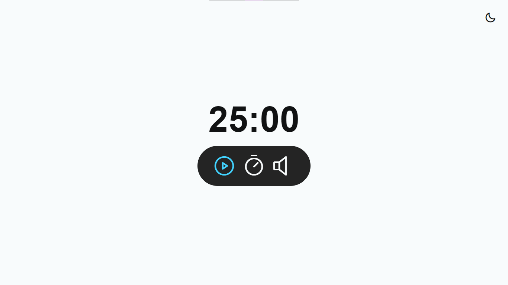
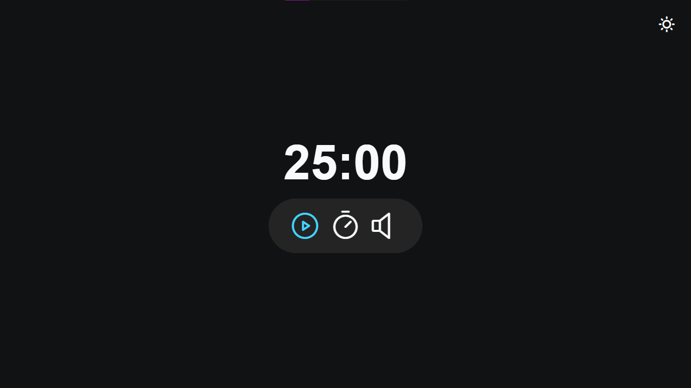

<h1 align="center">
Focus Timer
</h1>

  
  

## Tecnologias

Esse projeto foi desenvolvido com as seguintes tecnologias:

- JavaScript
- HTML
- CSS
<!-- - [Node.js](https://nodejs.org/en/)
- [React](https://reactjs.org)
- [React Native](https://facebook.github.io/react-native/)
- [Expo](https://expo.io/) -->

## 💻 Projeto

O Focus Timer é um projeto que tem como objetivo ser usado como sistema Pomodoro, ou utilizado como temporadizador, onde o usuário pode alterar os minutos para no máximo 60minutos, ativar o som com uma música ambiente, podendo pausar e reiniciar o timer.

Contendo também o modo light e dark, pro usuário utilizar como preferir.

## 🤔 Como contribuir

- Faça um fork desse repositório;
- Cria uma branch com a sua feature: `git checkout -b minha-feature`;
- Faça commit das suas alterações: `git commit -m 'feat: Minha nova feature'`;
- Faça push para a sua branch: `git push origin minha-feature`.

Depois que o merge da sua pull request for feito, você pode deletar a sua branch.

## Licença

Esse projeto está sob a licença MIT. Veja o arquivo [LICENSE](LICENSE.md) para mais detalhes.

